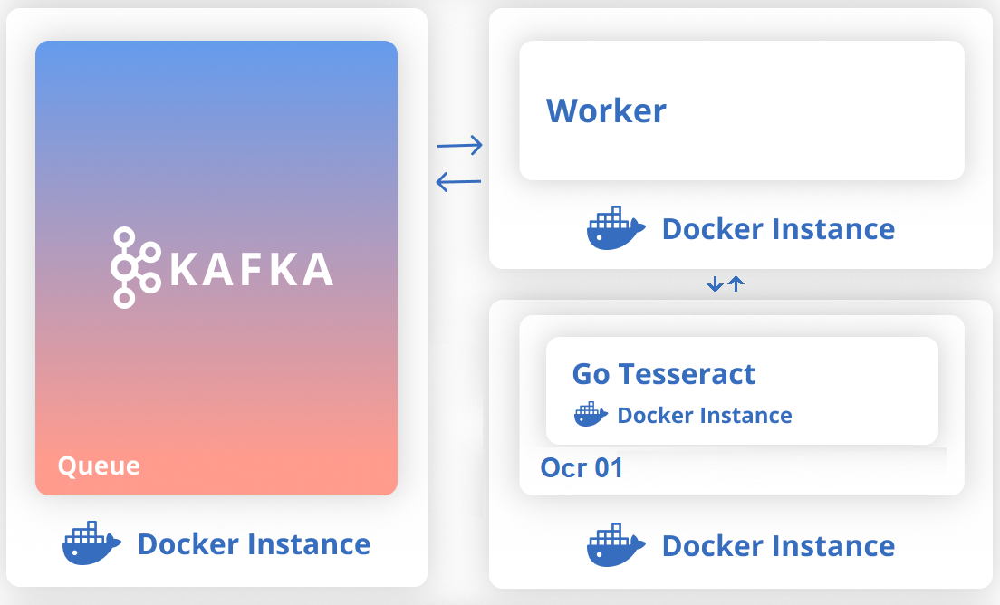

[](https://travis-ci.org/rsalcir/ocr-worker)

# Ocr-Worker


## Instalação
``` sh
docker pull johnnypark/kafka-zookeeper
docker pull rafaelteixeira/teixeiract
docker pull rsalcir/ocr-worker
```

## Execução
* iniciando o serviço do kafka
``` sh
docker run -p 2181:2181 -p 9092:9092 -e ADVERTISED_HOST=127.0.0.1 johnnypark/kafka-zookeeper
```
* iniciando o serviço de ocr
``` sh
docker run -p 3000:3000 rafaelteixeira/teixeiract
```
* iniciando o worker

variaveis de ambiente:

HOST_SERVICO_OCR

HOST_KAFKA

FILA_DE_DOCUMENTOS_NAO_PROCESSADOS

FILA_DE_DOCUMENTOS_PROCESSADOS

FILA_DE_ERRO_NO_PROCESSAMENTO_DOS_DOCUMENTOS

-Definindo uma ou mais variaveis de ambiente:

``` sh
docker run --network="host" -e FILA_DE_DOCUMENTOS_NAO_PROCESSADOS=nomeDaFilaDeNaoProcessados -e FILA_DE_DOCUMENTOS_PROCESSADOS=nomeDaFilaDeProcessado -e ... rsalcir/ocr-worker
```
-Utilizando variaveis de ambiente padrão:

valores default

HOST_SERVICO_OCR=http://localhost:3000

HOST_KAFKA=localhost:9092

FILA_DE_DOCUMENTOS_NAO_PROCESSADOS=arquivosNaoProcessados

FILA_DE_DOCUMENTOS_PROCESSADOS=arquivosProcessados

FILA_DE_ERRO_NO_PROCESSAMENTO_DOS_DOCUMENTOS=arquivosComErro
``` sh
docker run --network="host" rsalcir/ocr-worker
```
## Formato da mensagem para fila de entrada
``` sh
{"id" : "123", "url" : "https://minhaImagem.jpg"}
```
## Formato da mensagem para fila sucesso
``` sh
{"id" : "123", "texto" : "blablablablablablablablablablablablablablablablablabla..."}
```
## Formato da mensagem para fila erro
``` sh
{"id" : "123", "url" : "https://minhaImagem.jpg"}
```
## Construindo o container local
``` sh
sbt docker
```
## Comandos docker uteis
* Deletar todos os containers
``` sh
docker rm $(docker ps -a -q)
```
* Deletar todas as images
``` sh
docker rmi $(docker images -q)
 ```
